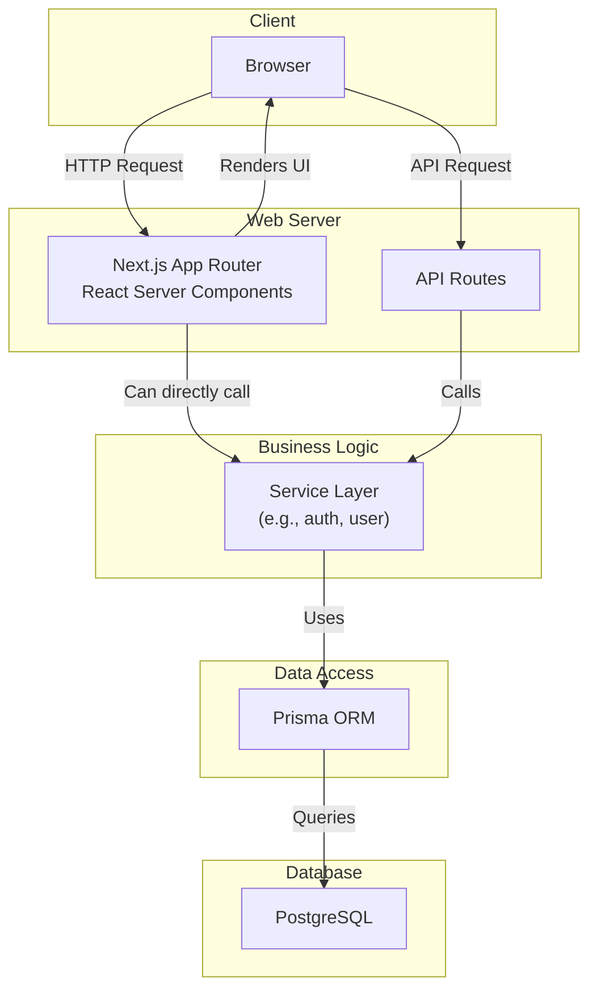

# Application Architecture

This document provides an overview of the application's architecture. The project is a full-stack application built with Next.js, utilizing the App Router.

## Layers

The application is structured into several distinct layers:

1.  **Frontend**: The user interface is built with **React** and **Next.js**. It uses the App Router for file-based routing and Server Components for rendering on the server. The UI components are located in `src/components`, with a distinction between general UI elements and shared, more complex components. Styling is likely handled by **Tailwind CSS**, given the project setup.

2.  **Backend (API)**: The backend is implemented using **Next.js API Routes** (or Route Handlers within the App Router). These routes handle client requests, perform business logic, and interact with the database.

3.  **Service Layer**: Business logic is abstracted into a service layer, found in `src/services`. This separates core functionalities like user management (`user.js`) and authentication (`auth.js`) from the API route handlers, making the code more modular and maintainable.

4.  **Data Access Layer**: **Prisma ORM** is used to interact with the database. It provides a type-safe way to perform database queries. The Prisma schema, located at `prisma/schema.prisma`, defines the database models.

5.  **Database**: The application uses a **PostgreSQL** database, as configured in the Prisma schema. A `docker-compose.yml` file is present, suggesting that the database is intended to be run in a Docker container for development.

## Architecture Diagram

The following diagram illustrates the flow of a request through the different layers of the application.

