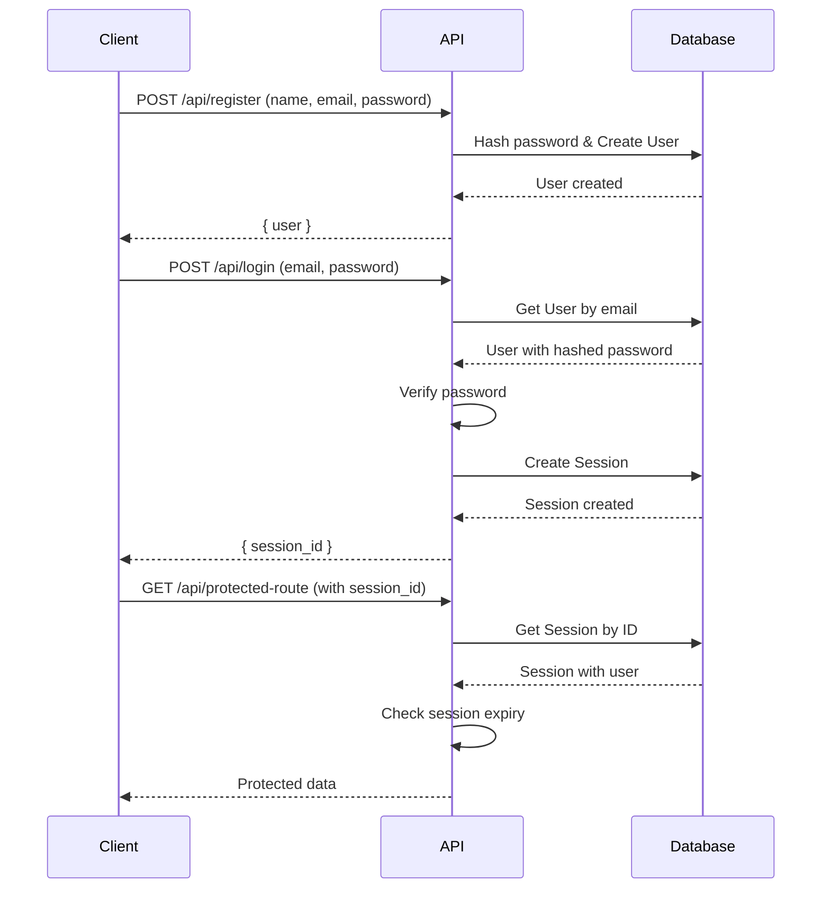

# Authentication Service

This document explains the authentication service and its related components. The authentication system uses a session-based approach.

## Core Components

- **User Service (`src/services/user.js`)**: Manages user creation and retrieval.
- **Auth Service (`src/services/auth.js`)**: Manages sessions and password verification.
- **Prisma Schema (`prisma/schema.prisma`)**: Defines the `User` and `Session` database models.

## Authentication Flow

The authentication process involves user registration, login, session management, and verification.

### Registration

1.  A new user provides their name, email, and password.
2.  The `createUser` function from the user service is called.
3.  The password is encrypted using `bcrypt`.
4.  A new `User` record is created in the database.

### Login

1.  The user provides their email and password.
2.  `getUserByEmail` retrieves the user from the database, including the hashed password.
3.  `verifyPassword` compares the provided password with the stored hash.
4.  If the password is valid, `createSession` generates a new session for the user with a 30-day expiration.
5.  The session ID is returned and should be stored on the client (e.g., in a cookie).

### Session Verification

1.  For protected actions, the client sends the session ID.
2.  `getSession` retrieves the session and the associated user data.
3.  It checks if the session exists and has not expired.
4.  If the session is valid, the user is authenticated.

## Mermaid Diagram

Here is a diagram illustrating the authentication flow:

