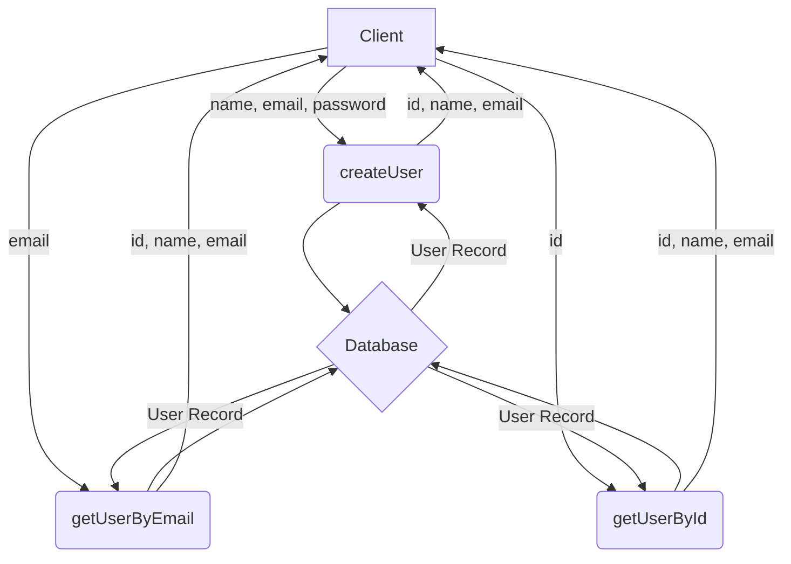

# User Service

This document describes the `user` service, which is responsible for managing user data.

## Core Functions

The user service, located in `src/services/user.js`, provides the following main functions:

- `createUser(name, email, password)`: Creates a new user in the database. It takes the user's name, email, and a plain text password. The password is then hashed using the `hashPassword` function from the `auth` service before being stored. It returns the `id`, `name`, and `email` of the newly created user.

- `getUserByEmail(email, withPassword = false)`: Retrieves a user by their email address. By default, it returns the user's `id`, `name`, and `email`. If the `withPassword` flag is set to `true`, it will also include the user's hashed password in the returned object. This is primarily used during the login process to verify a user's password.

- `getUserById(id)`: Fetches a user by their unique ID. It returns the user's `id`, `name`, and `email`.

## Data Model

The `User` data model is defined in `prisma/schema.prisma`. A user has the following fields:

- `id`: A unique identifier (CUID).
- `name`: The user's name.
- `email`: The user's unique email address.
- `password`: The user's hashed password.
- `createdAt`: Timestamp of when the user was created.
- `updatedAt`: Timestamp of the last update to the user's record.
- `sessions`: A relation to the sessions model, indicating a user can have multiple sessions.

## Mermaid Diagram

This diagram shows the basic interactions with the User service.

